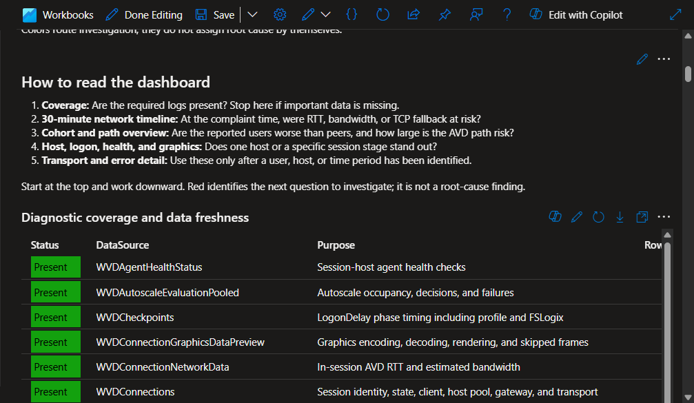
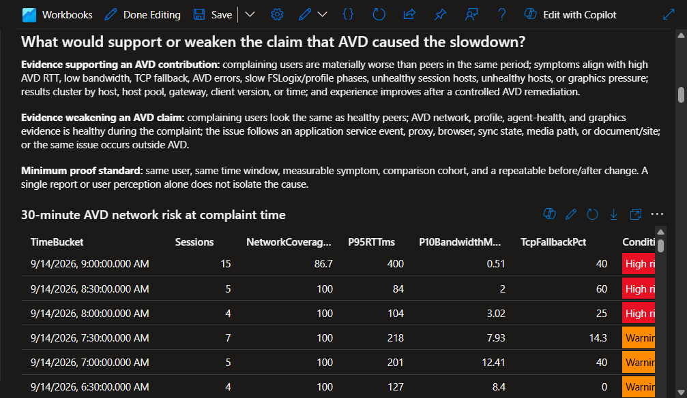
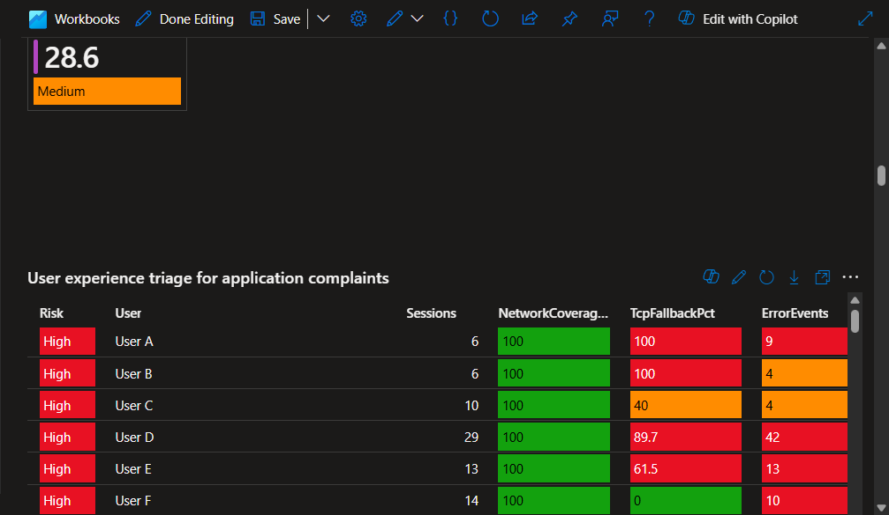
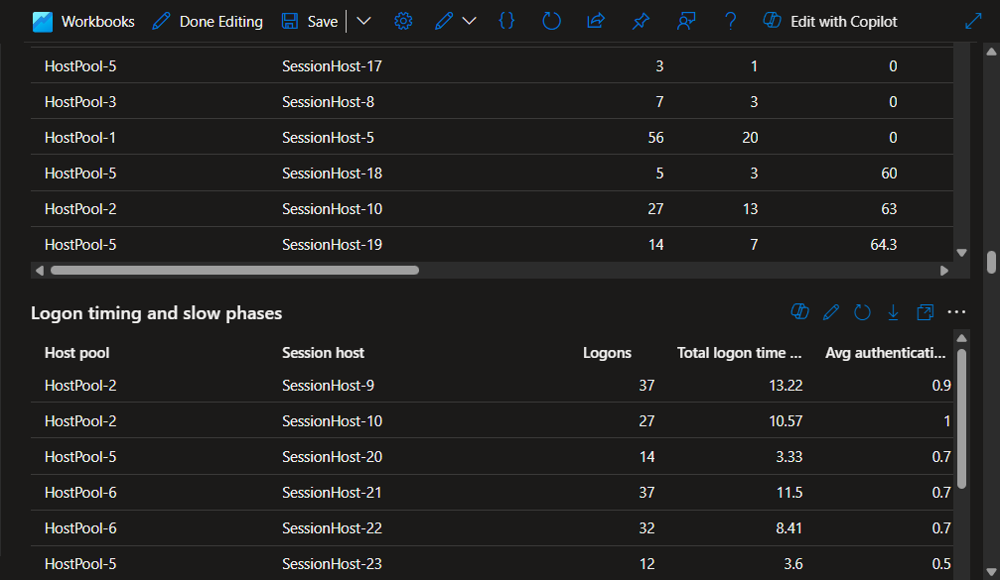
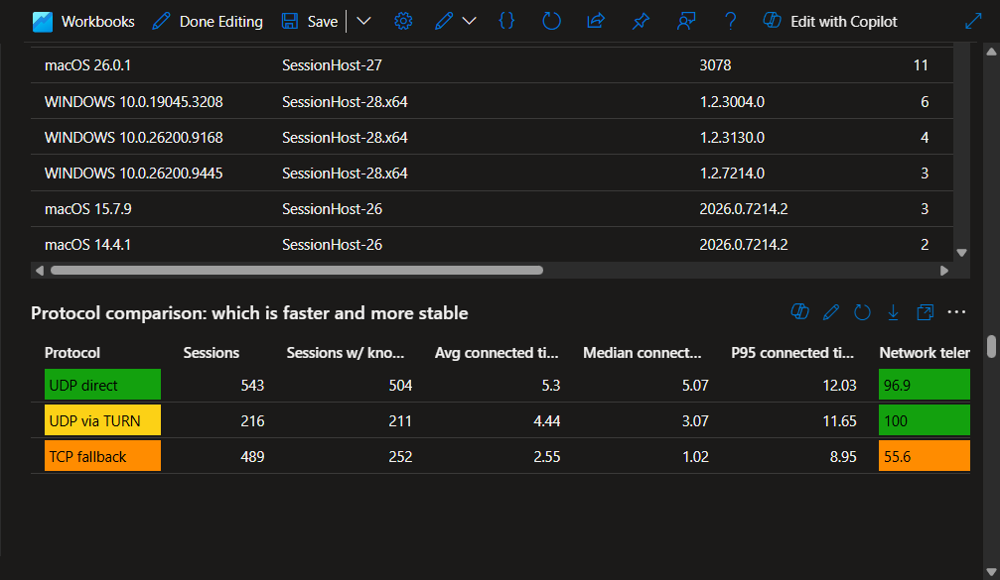
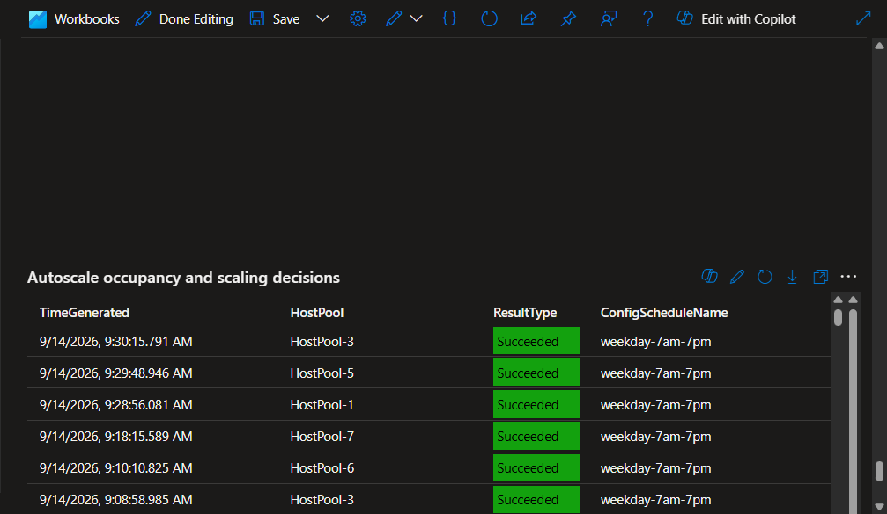

# Azure Virtual Desktop Investigation Workbook Guide

This workbook helps investigate Azure Virtual Desktop (AVD) connection, transport, logon, session-host, graphics, resource-discovery, scaling, and application-impact issues. Use it for a single-user complaint, a host-pool trend, a time-based incident, or a post-change validation; it does not require a comparison with another virtual desktop platform.

It accompanies [Azure Virtual Desktop Investigation workbook](AVD%20Application%20Experience%20Investigation.workbook), titled **Azure Virtual Desktop Investigation** in the Azure portal.

## What it establishes

The workbook tests whether poor user experience aligns with:

- High AVD round-trip time or constrained estimated bandwidth
- TCP fallback instead of UDP Shortpath
- AVD errors for the same users and sessions
- Slow authentication, Group Policy, profile, FSLogix, or shell phases
- Session-host health-check failures
- Graphics encoding, decoding, rendering, or skipped-frame pressure
- AVD client versions with unusually poor transport outcomes
- Workspace feed and published-resource retrieval failures
- Session-host registration, provisioning, management, or Autoscale changes near the reported issue

These are causal candidates and correlation evidence. AVD diagnostic logs do not directly measure application transaction time or application service health.

## Required telemetry

Enable these AVD diagnostic tables in the selected Log Analytics workspace. The first seven are the primary investigation sources; the last five explain operational changes around an incident.

- `WVDConnections`
- `WVDMultiLinkAdd`
- `WVDConnectionNetworkData`
- `WVDErrors`
- `WVDCheckpoints`
- `WVDAgentHealthStatus`
- `WVDConnectionGraphicsDataPreview`, when available
- `WVDFeeds`
- `WVDHostRegistrations`
- `WVDManagement`
- `WVDSessionHostManagement`
- `WVDAutoscaleEvaluationPooled`

## Workbook panel map

Use the panels in this order:

1. **Diagnostic coverage and data freshness:** confirms each WVD table is present and current.
2. **30-minute AVD network risk at complaint time:** identifies risk in the exact complaint window.
3. **Selected complaining users compared with peers:** tests whether the affected cohort differs from other users.
4. **Application experience: AVD path risk overview:** summarizes the selected scope as tiles.
5. **User experience triage for application complaints:** ranks users by AVD risk signals.
6. **30-minute AVD evidence export:** provides time-bucketed correlation data.
7. **Transport and bandwidth by session host:** locates hosts with transport or network anomalies.
8. **Logon timing and slow phases:** identifies authentication, profile, FSLogix, GPO, or shell delays.
9. **Unhealthy session hosts and failed health checks:** exposes host and agent failures.
10. **Graphics performance by host pool:** separates server, client, and network frame-delivery indicators.
11. **Client version and AVD transport readiness:** finds client versions with poor transport results.
12. **Protocol comparison: which is faster and more stable:** compares UDP direct, TURN, TCP fallback, and unknown transport.
13. **Average connected time and bandwidth by user and protocol:** deep-dives one user's transport behavior.
14. **Users who have never had a UDP connection:** identifies persistent non-UDP client or network paths.
15. **Which users/devices are hitting errors, and their network conditions:** ties repeated errors to session behavior.
16. **Session transport, RTT, and bandwidth details:** provides per-session evidence after narrowing the scope.
17. **Workspace feed and resource retrieval failures:** investigates desktop or RemoteApp discovery and refresh failures.
18. **Session host registration activity:** identifies hosts added, rebuilt, or repeatedly registering around an issue.
19. **AVD management changes near an incident:** shows resource changes preceding a regression.
20. **Session host provisioning and updates:** identifies configuration and deployment windows.
21. **Autoscale occupancy and scaling decisions:** relates capacity decisions and Autoscale failures to the incident period.

## Live workbook examples

### Dashboard reading order and diagnostic coverage



**Finding:** The investigation starts with the dashboard reading order and confirms WVD diagnostic coverage before interpreting risk indicators. **Scope:** Sanitized live AVD workbook view. **Next action:** Review the complaint-time network-risk panel only after the required sources are present.

Read the coverage table from left to right:

- **Status:** `Present` means records exist in the selected time range. `Present but stale` means the latest record is older than one day. `Missing or no rows in range` means stop and verify the diagnostic setting or time range.
- **DataSource:** the WVD table used by one or more workbook panels.
- **Purpose:** the diagnostic question the table answers.
- **Rows** and **LatestRecord:** evidence that the selected workspace is collecting current data, not proof that the AVD service is healthy.

### Complaint-time network risk



**Finding:** The selected live example contains high-risk and warning periods. **Scope:** Sanitized 30-minute aggregate AVD network view. **Next action:** Select the reported user and compare the matching time period with peer, host, and session evidence.

Read the risk table from left to right:

- **TimeBucket:** the 30-minute period to align with a reported issue.
- **Sessions:** number of connected AVD sessions in that period. Small counts are directional, not conclusive.
- **NetworkCoveragePct:** percentage of sessions with usable network samples. Gray/unknown below 50% means do not draw a network conclusion.
- **P95RTTms:** the worst 5% AVD round-trip time. Above 250 ms is high risk; 120-250 ms is a warning.
- **P10BandwidthMbps:** bandwidth seen by the lowest 10% of samples. Below 5 Mbps is high risk; 5-10 Mbps is a warning.
- **TcpFallbackPct:** percentage of sessions without an observed UDP path. Above 50% is high risk; 20-50% is a warning.
- **Condition:** red indicates one or more high-risk thresholds, orange indicates a warning, green indicates no threshold was met, and gray indicates insufficient coverage.

### User risk triage



**Finding:** The screenshot shows how the workbook ranks users when multiple AVD risk signals occur together. **Scope:** Sanitized live user-triage view. **Next action:** Select one high-risk user and review their session transport and timing details.

Use this table to choose the first user to investigate:

- **Risk:** the combined AVD risk category. High means at least one severe latency, bandwidth, transport, or error threshold was observed.
- **User:** sanitized user label in this example. In the live workbook, use this value with the user filter to narrow all panels to one person.
- **Sessions:** number of AVD sessions included for that user. More sessions make a repeated pattern more credible.
- **NetworkCoveragePct:** confirms whether the user's RTT and bandwidth values are representative.
- **TcpFallbackPct:** identifies users frequently unable to establish an observed UDP path.
- **ErrorEvents:** count of related AVD errors. Start with users having both repeated errors and poor transport or network values.
- **AvgRTTms** and **P95RTTms:** normal and degraded-path round-trip time. The P95 value highlights intermittent delays that an average can hide.
- **AvgBandwidthMbps** and **P10BandwidthMbps:** typical and lower-end estimated bandwidth. The P10 value exposes constrained periods.

### Session-host logon analysis



**Finding:** The screenshot shows the per-host logon table used to distinguish a broad network issue from a host or initialization issue. **Scope:** Sanitized live session-host view. **Next action:** Compare the slowest host with a healthy peer and inspect the largest logon phase.

Read the logon table in this order:

- **Host pool** and **Session host:** identify the AVD location of the logon. These labels are sanitized in the example.
- **Logons:** sample size for the host in the selected range.
- **Total logon time:** all observed logon time for the host; use it as context, not as a user-facing average.
- **Avg authentication** and **P95 authentication:** identify slow identity or authentication behavior. P95 is the slowest 5% and is the first value to compare between hosts.
- **Avg logon total:** the average complete Windows logon duration.
- **P95 logon total:** the slowest 5% complete logons. Review its component phases when this is high.
- **GPO, profile, FSLogix, and shell-start columns:** the largest phase identifies the next technical owner or remediation hypothesis.

### Protocol comparison



**Finding:** The screenshot compares observed transport paths across the selected AVD scope. **Scope:** Sanitized live protocol comparison. **Next action:** Investigate TCP fallback when it has shorter connections, poorer network coverage, higher RTT, or lower bandwidth than UDP.

Read the protocol rows as a comparison, not as a pass/fail score:

- **Protocol:** `UDP direct` is the preferred direct path. `UDP via TURN` is working UDP through a relay. `TCP fallback` is a reverse-connect path and warrants comparison with UDP, not an automatic incident.
- **Sessions** and **Sessions with known duration:** show the sample size and whether session-duration conclusions are supported.
- **Avg, Median, and P95 connected time:** longer and more consistent connection time generally indicates greater stability. A large gap between median and P95 indicates a wide range of session behavior.
- **Network telemetry coverage:** low coverage means the RTT and bandwidth values cannot represent all sessions in the row.
- **Avg/P95 RTT** and **Avg/P10 bandwidth:** compare these columns across transport types. Lower RTT and higher bandwidth are preferred; P95 RTT and P10 bandwidth show the degraded edge of the user population.

### Autoscale decisions



**Finding:** The screenshot shows a sequence of successful Autoscale evaluations under the selected schedule. **Scope:** Sanitized live operational diagnostics view. **Next action:** When complaints follow a time-of-day pattern, compare their time bucket with the Autoscale result, active-host count, occupancy, and scaling reason.

Read the Autoscale table as an operational timeline:

- **TimeGenerated:** time of the Autoscale evaluation; align it with the complaint time.
- **HostPool:** affected pool, sanitized in the example.
- **ResultType:** `Succeeded` confirms the evaluation completed. `Failed` requires a follow-up search of `WVDErrors` using the same `CorrelationId`.
- **ConfigScheduleName** and **ConfigSchedulePhase:** identify the Autoscale policy and phase that applied at that time.
- **SessionCount**, **ActiveSessionHostCount**, **TotalSessionHostCount**, and **SessionOccupancyPercent:** show the active capacity context.
- **ScalingReasonMessage:** explains why Autoscale started, stopped, or retained capacity; use it to distinguish a deliberate decision from an unexpected condition.

## Screenshot companion

Use screenshots to make an investigation handoff easier to follow. Capture the following views in the stated order and place each image directly below its matching guide section or incident finding.

| Screenshot | Capture target | What it demonstrates |
| --- | --- | --- |
| 1. Workbook landing view | Workbook title and the workspace, time-range, host-pool, gateway, user, and transport filters | The selected investigation scope |
| 2. Coverage view | **Diagnostic coverage and data freshness** | Required WVD sources are present and current before interpreting other results |
| 3. Complaint-time view | **30-minute AVD network risk at complaint time** | Whether RTT, bandwidth, TCP fallback, or insufficient coverage was present in the reported time window |
| 4. User triage view | **User experience triage for application complaints** | Which users have the strongest AVD-side risk signals and why they are ranked high |
| 5. Host and logon view | **Transport and bandwidth by session host** or **Logon timing and slow phases** | Whether the issue clusters on one host or in a session phase |
| 6. Operational-change view | **Autoscale occupancy and scaling decisions**, **Session host provisioning and updates**, or **AVD management changes near an incident** | Whether a configuration, deployment, or scaling event aligns with the reported issue |
| 7. Evidence-detail view | **Session transport, RTT, and bandwidth details** | The final user/session-level evidence behind the conclusion |

Do not publish a portal screenshot until it has been redacted. Remove or obscure user names, email addresses, IP addresses, workspace and subscription identifiers, resource-group names, host names, tenant names, correlation IDs, and any customer-specific application or incident data. Retain only the panel title, column labels, color status, and values required to support the documented finding.

Use a short caption beneath every screenshot in this form: **Finding:** [observed condition]. **Scope:** [time range, host pool, or cohort]. **Next action:** [specific validation or remediation].

## Investigation workflow

1. Select the Log Analytics workspace and the complaint time range.
2. Open **Diagnostic coverage and data freshness**. Treat every missing source as an evidence gap, not a healthy result.
3. Open **30-minute AVD network risk at complaint time** and find the complaint window. Do not interpret RTT or bandwidth if coverage is gray.
4. Select reported users and compare **Selected complaining users compared with peers**.
5. Open **User experience triage for application complaints** to identify users with high RTT, constrained bandwidth, TCP fallback, or AVD errors.
6. Review transport by session host, logon phases, AVD agent health, graphics, client-version, protocol, and error-detail panels.
7. When symptoms align with an environment change, review feed retrieval, host registration, management changes, provisioning updates, and Autoscale decisions.
8. Export **30-minute AVD evidence export** and align `User`, `TimeBucket`, and `SessionHost` with the complaint timestamp and application telemetry.
9. Validate the affected application's service and client telemetry before assigning cause.

## Customer evidence request

Ask for a reproducible complaint set rather than a general statement that AVD is slow:

- Five to ten affected users and, if possible, five users reporting acceptable performance
- Exact timestamps with time zone, frequency, and duration
- The exact application and operation, with a repeatable start and stop condition
- AVD host pool, session host, client OS/type/version, user location, and network type
- Whether the same operation is slow outside AVD at the same time
- Whether all users, one site, one network, one host pool, one image, or one session host is affected
- A screen recording or stopwatch measurement with a repeatable start and stop condition
- A pre-migration measurement from Citrix/legacy VDI using the same operation and content

Capture migration differences that can change application performance independently of the AVD control plane:

- Session-host VM size, disk type, host density, autoscale behavior, and acceleration/GPU settings
- Windows image build, installed application versions, update channels, and add-ins
- FSLogix version, profile/container storage, cache exclusions, container size, and attach latency
- Proxy, PAC file, DNS, TLS inspection, firewall, VPN, and egress routing
- Security/EDR/DLP agents and scanning exclusions relevant to the affected application and FSLogix paths
- Application client configuration, cache state, sync state where applicable, and authentication behavior

## External application evidence

Collect the application's authoritative service health, client diagnostics, operation timing, and error data. For browser workloads, collect network traces, proxy/TLS inspection, DNS, authentication redirects, and the specific URL or transaction. Compare the same account and operation inside and outside AVD.

## Interpretation

- Poor application telemetry plus poor AVD evidence in the same user/time window supports an AVD path, host, profile, or client hypothesis.
- Poor application telemetry plus healthy AVD evidence shifts the investigation toward the application service, proxy/content path, or endpoint configuration.
- Poor AVD evidence without a matching application symptom is not proof that it caused the reported slowdown.
- Low network telemetry coverage means RTT and bandwidth aggregates may not represent the full session population.
- Affected users being materially worse than peers strengthens the case; similar cohort results weaken it.
- Clustering by session host, gateway, client version, user location, or time provides a testable remediation target.
- The strongest conclusion comes from a controlled change followed by repeat measurement of the same operation.

## Dashboard colors

- **Red:** strong risk signal or missing telemetry. Examples include P95 AVD RTT above 250 ms, P10 bandwidth below 5 Mbps, more than 50% TCP fallback, repeated AVD errors, or an unhealthy endpoint.
- **Orange:** warning signal. Examples include P95 AVD RTT above 120 ms, P10 bandwidth below 10 Mbps, more than 20% TCP fallback, or intermittent AVD errors.
- **Green:** healthy against the workbook threshold. Green does not prove that the application was healthy.
- **Gray:** unknown, unavailable, or informational. Missing evidence must not be reported as success.
- **Yellow:** UDP via TURN. TURN is functional UDP, but it is relayed and should be compared with direct UDP and TCP measurements before drawing conclusions.

## Deploy

## Azure portal import and first run

The workbook must be imported and saved before the portal can run its queries. A page headed **Unsaved Workbook** is a blank draft; it does not contain the investigation panels yet.

1. In the target Log Analytics workspace, open **Workbooks** and create or open a workbook draft.
2. Open the workbook's **Advanced Editor**, replace the draft JSON with the contents of [Azure Virtual Desktop Investigation workbook](AVD%20Application%20Experience%20Investigation.workbook), then apply the changes.
3. Select the target **Log Analytics workspace** in the workbook parameter bar and set the complaint time range.
4. Run **Diagnostic coverage and data freshness** first. Enable missing AVD diagnostic categories before relying on any other panel.
5. Save the workbook with the display name **Azure Virtual Desktop Investigation** in the intended resource group and subscription.

The workbook has no embedded tenant, subscription, or resource-group identifier. Selecting the workspace in the parameter bar controls which Log Analytics data is queried.

Use the existing deployment script and override the display name:

```powershell
.\Deploy-Workbook.ps1 `
    -ResourceGroupName '<resource-group>' `
    -WorkbookFileName 'AVD Application Experience Investigation.workbook' `
    -DisplayName 'AVD Application Experience Investigation'
```
